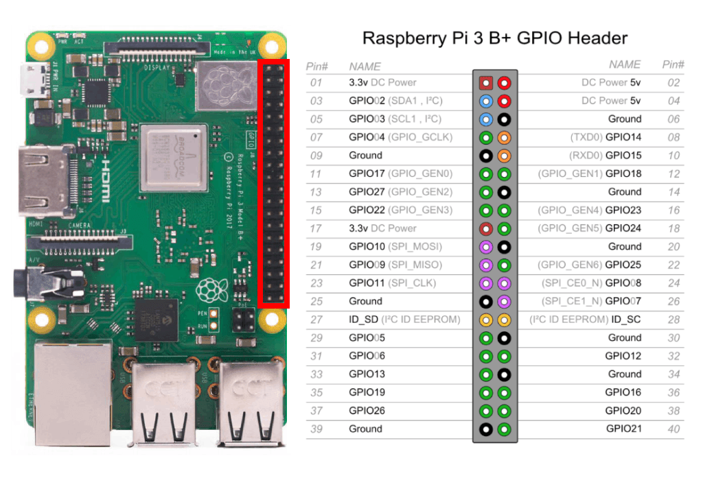

# Steps towards firmware development

## Firmware builing
- Embassy with NRF52840-hal
- TODO

## Firmware flashing
- Copy the compiled binary file to the raspberry pi using scp
    - `$scp <bin_filename> <your_usernme>@192.168.188.247:<your_absolute_system_path>`
- Configure OpenOCD
    - Edit the file `openocd.cfg` in the current directory and paste this
        ```
        bindto 0.0.0.0

        source [find interface/raspberrypi-native.cfg]

        transport select swd
        set CHIPNAME nrf52
        source [find target/nrf52.cfg]

        reset_config srst_nogate
        adapter srst delay 100
        adapter srst pulse_width 100

        init
        targets
        reset halt
        ```
    - NOTE: Raspberry port 4444 is exposed by binding OpenOCD to broadcast address 0.0.0.0 (see config file)
    - Open port 4444 from firewall
        - Use iptables OR ufw (easier: `$ufw allow 4444`)
    - Start OpenOCD with `$openocd` (you might need to run it with superuser privileges with sudo)
    - Try to connect from laptop to raspi's telnet with `$telnet 192.168.188.247 4444`
        - You should see an "Open On-Chip Debugger" telnet prompt, if not, check steps above
- OpenOCD flashing
    - Connect from laptop to raspi's telnet with `$telnet 192.168.188.247 4444`
    - Send the following commands to the "Open On-Chip Debugger" telnet prompt to flash and verify
        ```bash
        init
        reset halt
        program <bin_filename> verify
        reset
        (OPTIONAL to close OpenOCD) shutdown
        ```
- TODO

## Firmware debugging
- GDB configuration
    - Install gdb-multiarch on the laptop
    - Open port 4444 from firewall
        - Use iptables OR ufw (easier: `$ufw allow 4444`)
- GDB Debugging
    - Start OpenOCD (if not already running)
    - Start GDB client on laptop by running `$gdb-multiarch`
    - Connect to the remote target `(gdb) target extended-remote 192.168.188.247:3333`

- TODO

# Images


# Sources
- https://cdn-learn.adafruit.com/downloads/pdf/programming-microcontrollers-using-openocd-on-raspberry-pi.pdf
- https://learn.adafruit.com/programming-microcontrollers-using-openocd-on-raspberry-pi/wiring-and-test
